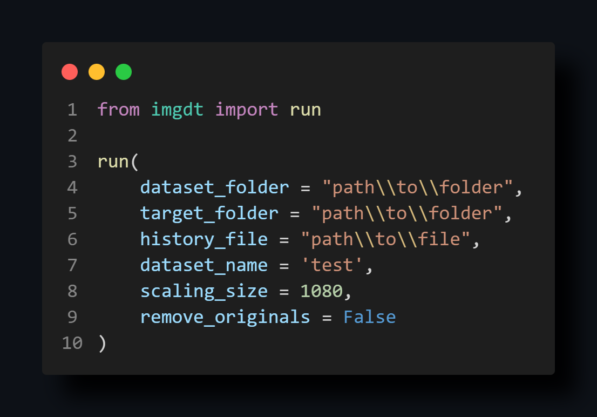

# imgdt (*Images Dataset Transformer*)

## Tool/Library Pipeline

- **Convert images** from '.png', '.jpeg', '.gif', '.bmp' to '.jpg'.
- **Ordinal rename images**.
- Create the conversion history file, useful to avoid reconversion in future operations on the same dataset.
- **Rescale images** to a user-defined pixels resolution.
- **Square crop images**.

### Documentation

#### ```imgdt.main()```

- **```dataset_folder```** ```(str)```: path to the dataset folder.
- **```target_folder```** ```(str)```: path to the target folder (default: dataset parent folder).
- **```history_file```** ```(str)```: path to the history file (default: dataset parent folder).
- **```dataset_name```** ```(str)```: prefix for renamed images and new folders (default: ```None```).
- **```scaling_size```** ```(int)```: target size (px) for scaling images (default: ```1080```).
- **```remove_originals```** ```(bool)```: remove original images after conversion (default: ```False```)

#### Usage example ([see examples](examples))



### Info
<div></div>
<div></div>
<a>
  
</a>
